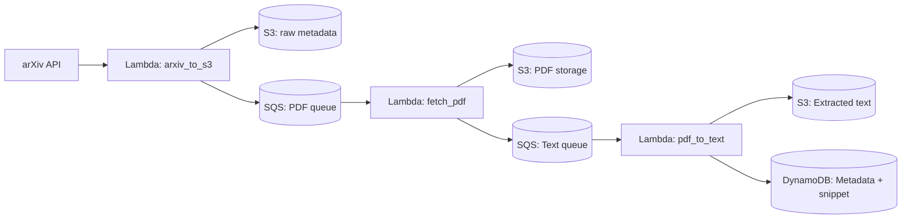

# Bibliographic Watch Tool (AWS-based)

🚧 **Work in Progress** 🚧  
This repository contains the initial skeleton of a **bibliographic watch tool** I am developing as part of my learning journey in **AWS Data Engineering**.  
The goal is to build a cloud-native application to automatically process, store, and analyze scientific articles.

---

## 📌 Objectives
- Explore **AWS services** (S3, DynamoDB, Lambda, Textract, Glue, Athena, QuickSight, …).  
- Learn how to **design scalable data pipelines** for text-heavy datasets (PDFs, scientific papers).  
- Apply cloud and AI tools to a **real-world use case in scientific research**.  
- Showcase my progress as part of my **portfolio** in data engineering and cloud computing.  

---

## 🗂️ Current Status
- ✅ Project skeleton created  
- ✅ First Lambda implemented: **arxiv_to_s3** (ingest metadata from arXiv)  
- ✅ Store PDFs in S3  
- ✅ Extract text (Textract + PyPDF2 fallback)
- ✅ Generate LLM-based literature reviews
- ✅ Structure metadata in DynamoDB
- ⏳ Next steps:
  - Query with Athena  
  - Build dashboards in QuickSight  

---

## 🏗️ Architecture



## 🛠️ Tech Stack
- **AWS**: S3, Lambda, DynamoDB, SQS, Textract, Glue, Athena  
- **Python**: data processing and orchestration  
- **GitHub**: version control, project tracking  

---

## 📅 Roadmap
- [x] Lambda to fetch and filter arXiv metadata  
- [x] Store PDFs in S3  
- [x] Text extraction (Textract + PyPDF2 fallback)  
- [x] DynamoDB integration  
- [ ] Athena queries  
- [ ] QuickSight dashboards  
- [x] Automated summaries with LLMs (ChatGPT / Bedrock)

---

## 🖥️ Lambda Functions

### arxiv_to_s3
Fetches recent articles from the arXiv API, filters them by keywords, and ingests metadata into S3.  
Also sends PDF download instructions to SQS for downstream processing.

**Environment variables:**
- `S3_BUCKET`: Target bucket for raw metadata  
- `PDF_QUEUE_URL`: SQS queue for PDF processing  
- `ARXIV_QUERIES`: List of queries separated by `;` (optional)  
- `ARXIV_QUERY`: Fallback single query (if `ARXIV_QUERIES` not set)  
- `ARXIV_MAX_RESULTS`: Max number of results (default: 25)  
- `KEYWORDS_ANALYTICAL`: Keywords for analytical chemistry (e.g. `gc-ms;lc-ms;proteomics;metabolomics`)  
- `KEYWORDS_APPLICATIONS`: Keywords for application domains (e.g. `biomarkers;clinical chemistry;food analysis`)  
- `KEYWORDS_CLOUD`: Keywords for cloud & AI (e.g. `aws;azure;machine learning;neural networks`)  

**Sample event JSON:**
```json
{
  "query": "all:chromatography AND all:deep learning"
}
```
---

### fetch_pdf
Downloads article PDFs from arXiv (based on messages sent to SQS by `arxiv_to_s3`) and stores them in S3.  
Once stored, it sends a message to another SQS queue (`TEXT_QUEUE_URL`) for downstream text extraction.

**Workflow:**
1. Reads messages from `PDF_QUEUE_URL` containing `id`, `url_pdf`, and minimal metadata.  
2. Downloads the PDF file from arXiv.  
3. Stores it in S3 under `pdf/arxiv/<paper_id>.pdf`.  
4. Sends a new message to `TEXT_QUEUE_URL` with the S3 key for the PDF.  

**Environment variables:**
- `S3_BUCKET`: Target bucket where PDFs are stored  
- `TEXT_QUEUE_URL`: SQS queue used to send messages for text extraction  

**Sample SQS message input:**
```json
{
  "id": "2502.13183v1",
  "url_pdf": "https://arxiv.org/pdf/2502.13183v1.pdf",
  "metadataMin": {
    "title": "Generative autoencoders for GC-IMS data",
    "authors": ["Author One", "Author Two"],
    "published_at": "2025-02-13T00:00:00Z"
  }
}
```
---

### pdf_to_text
Extracts text content from PDFs stored in S3 and saves both the plain text (in S3) and structured metadata (in DynamoDB).
Uses **Textract** by default and falls back to **PyPDF2** if Textract does not support the document.

**Workflow:**
1. Reads messages from `TEXT_QUEUE_URL` containing `id`, `s3_pdf_key`, and minimal metadata.  
2. Downloads the PDF from S3.  
3. Normalizes the file (using PyPDF2).  
4. Runs AWS Textract for text extraction (fallback to PyPDF2 if unsupported).  
5. Stores extracted text in S3 under `text/arxiv/<date>/<id>.txt`.  
6. Inserts or updates a record in DynamoDB with metadata, S3 keys, and a snippet of extracted text.  

**Environment variables:**
- `S3_BUCKET`: Target bucket where PDFs and extracted text are stored  
- `DDB_TABLE`: DynamoDB table name for storing metadata and extracted text  
- `TEXT_PREFIX`: S3 prefix for extracted text (default: `text/arxiv`)  
- `MAX_TEXT_LENGTH`: Maximum number of characters from the extracted text stored in DynamoDB (default: `1000`)  

**Sample SQS message input:**
```json
{
  "source": "arxiv",
  "id": "2502.13183v1",
  "s3_pdf_key": "pdf/arxiv/2502.13183v1.pdf",
  "metadataMin": {
    "title": "Generative autoencoders for GC-IMS data",
    "authors": ["Author One", "Author Two"],
    "published_at": "2025-02-13T00:00:00Z"
  }
}
```
---

### generate_review
Creates a synthetic literature review document by orchestrating ChatGPT over the articles already processed and indexed in DynamoDB.
The generated review is stored in S3 for later consultation.

**Workflow:**
1. Retrieves the latest articles (or a provided list of IDs) from DynamoDB.
2. Loads the associated text snippets from S3.
3. Builds a structured prompt consolidating metadata and content snippets.
4. Calls ChatGPT (configurable via `OPENAI_MODEL`) to produce a French summary with recommendations.
5. Stores the generated review in S3 under the `reviews/` prefix as JSON.

**Environment variables:**
- `S3_BUCKET`: Bucket storing article assets and review outputs.
- `DDB_TABLE`: DynamoDB table containing article metadata.
- `OPENAI_API_KEY`: API key used to invoke ChatGPT.
- `OPENAI_MODEL`: Optional, model name (default: `gpt-4o-mini`).
- `MAX_REVIEW_ARTICLES`: Optional, maximum number of articles to summarise (default: `5`).
- `REVIEW_PREFIX`: Optional, S3 prefix where the review JSON is written (default: `reviews`).
- `OPENAI_TEMPERATURE`: Optional, sampling temperature (default: `0.3`).

**Sample event JSON:**
```json
{
  "paper_ids": ["2502.13183v1", "2502.14567v1"],
  "limit": 3
}
```
---

## 🙋 About Me
I am an **Application Engineer in Analytical Chemistry** (GC/GC-MS) exploring **cloud computing and AI** to build practical tools for data analysis and automation.  
This project is part of my path toward the **AWS Data Engineer – Associate certification** and my broader portfolio of applied AI/cloud solutions.

---

## ⚠️ Disclaimer
This is an **educational project**. Code is experimental and subject to change.  
Please do not use in production without proper review and testing.
